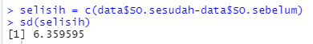
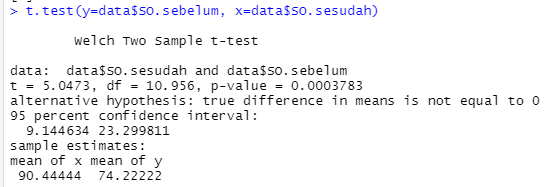
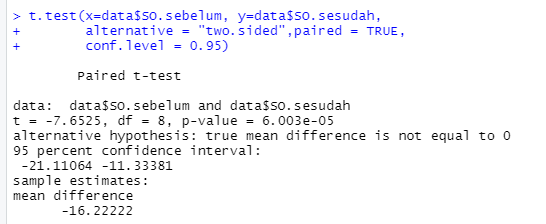
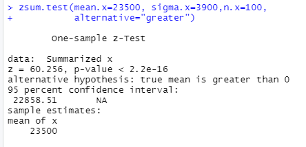

# P2_Probstat_A_05111840007002

## 1.

**1.a. Standar Deviasi dari data selisih pasangan pengamatan**

**1.b. nilai t (p-value)**

**1.c.**

H0 : “tidak ada pengaruh yang signifikan secara statistika dalam hal kadar saturasi oksigen, sebelum dan sesudah melakukan aktivitas 𝐴”

Pada gambar diatas, dapat dilihat bahwa niai p-value kurang dari alfa(0.05).
dengan begitu dapat diambil keputusan untuk *menolak H0*. dan dapat diambil kesimpulan bahwa  terdapat pengaruh yang signifikan dalam hal kadar saturasi 
oksigen, sebelum dan sesudah melakukan aktifitas A

## 2.

**2.a Apakah Anda setuju dengan klaim tersebut?**

Iya, saya setuju dengan klaim tersebut. karena rata-rata dari sampel acak menunjukkan nilai rata-rata diatas 20.000 Kilometer

**2.b Jelaskan maksud dari output yang dihasilkan**

dari hasil output tersebut, didapatkan nilai Z = 60.256 dan nilai p-value kurang dari 0.05. dan selang kepercayaan berada pada 22858 sampai tak hingga.

**2.c  kesimpulan berdasarkan P-Value yang dihasilkan**

H0 : "rata-rata jarak tempuh mobil <= 20000 kilometer.

dengan nilai p-value dibawah 0.05, dapat diambil keputusan untuk menolak H0. dan dapat disimpulkan bahwa klaim yang ada dapat dibenarkan. yaitu rata-rata jarak tempuh mobil lebih dari 20000 kilometer.
