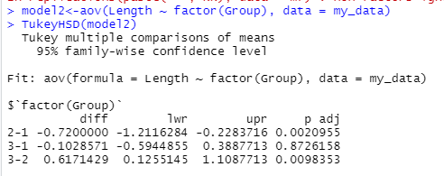

# P2_Probstat_A_05111840007002

## 1.

**1.a. Standar Deviasi dari data selisih pasangan pengamatan**

**1.b. nilai t (p-value)**

**1.c.**

H0 : “tidak ada pengaruh yang signifikan secara statistika dalam hal kadar saturasi oksigen, sebelum dan sesudah melakukan aktivitas 𝐴”

Pada gambar diatas, dapat dilihat bahwa niai p-value kurang dari alfa(0.05).
dengan begitu dapat diambil keputusan untuk *menolak H0*. dan dapat diambil kesimpulan bahwa  terdapat pengaruh yang signifikan dalam hal kadar saturasi 
oksigen, sebelum dan sesudah melakukan aktifitas A

## 2.

**2.a Apakah Anda setuju dengan klaim tersebut?**

Iya, saya setuju dengan klaim tersebut. karena rata-rata dari sampel acak menunjukkan nilai rata-rata diatas 20.000 Kilometer

**2.b Jelaskan maksud dari output yang dihasilkan**

dari hasil output tersebut, didapatkan nilai Z = 60.256 dan nilai p-value kurang dari 0.05. dan selang kepercayaan berada pada 22858 sampai tak hingga.

**2.c  kesimpulan berdasarkan P-Value yang dihasilkan**

H0 : "rata-rata jarak tempuh mobil <= 20000 kilometer.

dengan nilai p-value dibawah 0.05, dapat diambil keputusan untuk menolak H0. dan dapat disimpulkan bahwa klaim yang ada dapat dibenarkan. yaitu rata-rata jarak tempuh mobil lebih dari 20000 kilometer.
<<<<<<< HEAD

## 3.

## 4.
**4.a**

**Membagi menjadi 3 grup dan melihat kuantil normal**

**Melihat Outlier Homogenitas**

dari plot diatas dapat dilihat bahwa tidak ada outlier dalam homogenitas varians

**4.b. Homogeneity of variances, nilai p, hipotesis dan kesimpulan yang dapat diambil**

didapatkan nilai p-value sebesar 0.8054, dengan begitu dapat diambil keputusan untuk gagal tolak H0. dan dapat diambil kesimpulam bahwa tidak ada perbedaan panjang antara ketiga spesies, atau rata-rata panjangnya sama.

**4.c. Uji ANOVA**

**4.d nilai-p, simpulan**

dari gambar pada 4.c, dapat dilihat bahwa p-value = 0,64. dan dapat di simpulkan bahwa H0 gagal tolak, itu berarti tidak ada perbedaan panjang antara ketiga spesies.

**4.e  Post-hoc test Tukey HSD**

dari hasil  Post-hoc test Tukey HSD, perbandingan dari kucing mendapatkan hasil yang berbeda. nilai p dari penbandingan group 2:1 dan 3:2, terdapat perbedaan yang signifikan karena nilai p < 0.05 yang berarti tolak H0. namun pada group 3:1 tidak terdapat perbedaan yang signifikan, karena nilai p dari perbandingan tersebut lebih dari 0.05.
sehingga kucing pada droup 2 memiliki panjang yang berbeda.

**4.f Plot Data**

